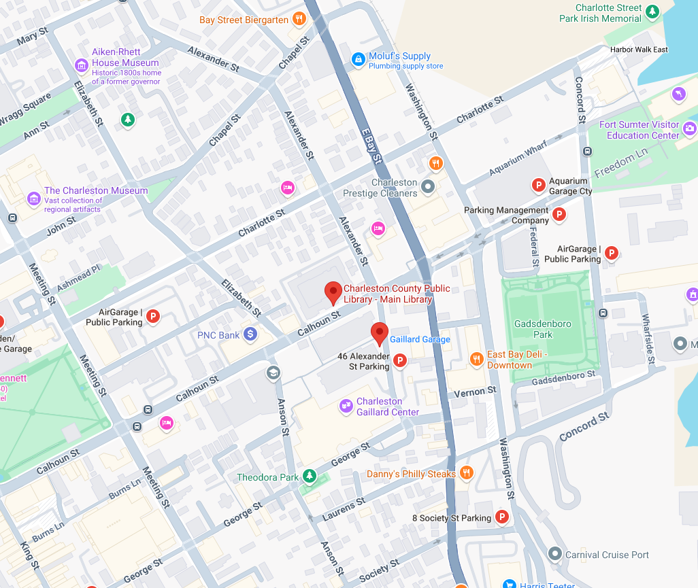

alias:: library
tags:: place
address:: [68 Calhoun](https://maps.app.goo.gl/GBRgZ9tZE83B73PJ8)

- A short 10min walk from the College of Charleston, the Main Branch of the Charleston County Public Library has meeting rooms for community presentations.
-
- Nearby parking garages include:
	- * [Galliard Garage - 32 Alexander St.](https://maps.app.goo.gl/61a5j85hkREKqBvu7)
	- * [46 Alexander St Parking](https://maps.app.goo.gl/wA5KvVKBE1hJ5yfB9)
-
- more info at https://www.ccpl.org/
-
- 
-