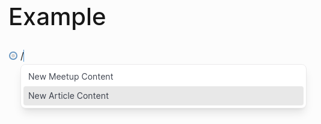

tags:: management

-
- Create an new page, then type `/template` and select one of the templates for the content:
	- 
- Replace the default values with content.
-
- ### Meetings
- These are displayed on the **homepage** under **Meetings and Video Presentations**
- Use the `meetup` tag and the following ones.  Don't forget double-colons:
	- ```
	  tags:: technical, meetup
	  by:: [[Foo]]
	  event-ulr:: https://www.charlestonlc.org/classes/charleston-lean-proof-assistant-meetup/
	  date:: 2019-11-05
	  ```
- Tags go from most to least specific, they will be displayed in that order.
-
- Other properties
	- **presenter** by-line, the person presenting.  Ensure they have a page
	- **event-url** URL for the RSVP or signup
	- **date** date of meetup
-
- ### Articles
- These are displayed on the **homepage** under **Discover Functional Programming**
- Use the `article` tag and the following ones:
	- ```
	  tags:: semi-technical, article
	  by:: [[Foo]]
	  date:: 2016-03-26
	  ```
-
- ### Technical Levels
	- technical
	- semi-technical
	- non-technical
-
- ### Images
	- Aim for 800x600
	- 4:3 ratio, good for small screens
	- good for desktop with sidebar open
	-