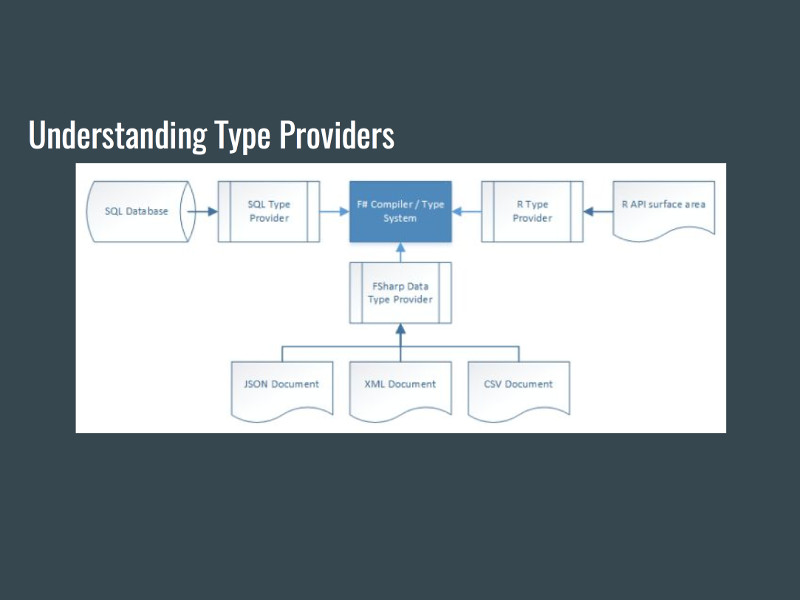

tags:: Fsharp, technical, video, meetup
by:: [[Andre Dublin]] 
date:: 2017-02-28

- {:height 608, :width 800}
-
- Introduced in [[F Sharp]] 3.0, Type Providers are components that provide types, properties, and methods to an application to facilitate information rich programming.  In other words a type provider automatically exposes the types which represent provider’s data structures.
-
- Type Providers are compiler plug-ins that provide us with types, that is they interrogate a data source and expose the underlying schema through familiar constructs such as classes and records.  We then code against the provided types as though they were actively maintained within the code, the result is simplified access.
- * [video presentation](https://www.youtube.com/watch?v=QewXSlSFiHE) (YouTube)
  * [[Andre Dublin]] biography
  * [slides](../assets/FsharpTypeProviders.pdf) (pdf)
-
- <iframe id="ytplayer" type="text/html" width="640" height="390"
    src="https://www.youtube.com/embed/QewXSlSFiHE?autoplay=0&origin=http://functional.sc"  frameborder="0"></iframe>
-
- {{embed [[Andre Dublin]]}}