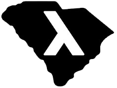

alias:: Welcome, functional-sc

- 
-
- Functional Programming is style of crafting software that allows programmers to create **simpler software** for complex problems, saving you money and time.
-
- We advocate for all functional programming technologies, in many standard programming languages or with one tailored for it such as: [[Haskell]], [[Clojure]], [[F Sharp]], [[Erlang]], [[OCaml]] and more.
-
- Based in historic Charleston, South Carolina we are open to all to learn and explore technology.
-
- @@html: <table><tbody><tr><td><b>CORRECT</b>: Powerful type systems shake out many problems before the program even runs.</td><td><b>CONCURRENT</b>: Doing more than one thing at a time is easier with Functional Programming.</td></tr><tr><td><b>EXPRESSIVE</b>: Abstract away boilerplate commonly found in popluar programming languages.</td><td><b>DECLARATIVE</b>: Why tell the computer how to do something when you can just tell it what you want?</td></tr><tr><td><b>NO SIDE EFFECTS</b>: The metaphorical rug isn't pulled from under your feet with small, reusable functions that don't tarnish the environment.</td><td><b>TESTABLE</b>: This highly abstract environment leads to automated testing.</td></tr></tbody></table> @@
- # Join Us
- {{embed [[Next Meeting]]}}
- # Discover Functional Programming
- {{query (page-property :tags "article")}}
  query-properties:: [:page :tags]
-
- # Meetings and Video Presentations
- {{query (page-property :tags "meetup")}}
  query-properties:: [:page :presenter :tags :date]
-
-
- # News and Updates
- <iframe allowfullscreen sandbox="allow-top-navigation allow-scripts allow-popups allow-popups-to-escape-sandbox" width="640" height="800" src="https://mastofeed.com/apiv2/feed?userurl=https%3A%2F%2Ffunctional.cafe%2Fusers%2Ffunctional_sc&theme=dark&size=100&header=true&replies=false&boosts=false"></iframe>
-
-