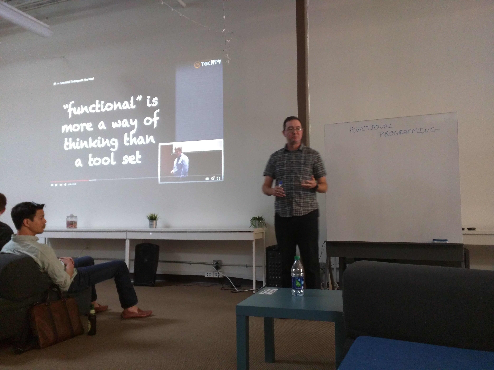

tags:: Haskell, Clojure, semi-technical, video, meetup
by:: [[Heow Goodman]] 
date:: 2016-04-19

- 
-
- Concepts of functional programming is made much harder when the developer is also trying to learn a new language, like [[Haskell]], Scala or [[Clojure]] at the same time. With that in mind, we focus on relating functional concepts in a common language: Java.
-
- There is a video presentation intended for technical and semi-technical alike. Although programming techniques are discussed, semi-technical audiences can fully appreciate the the rationale and flexibility of functional programming.
-
- Video presentation:
  
  [https://www.youtube.com/watch?v=JeK979aqqqc&index=4&list=PLB8bONI91cF5-cK_CdaeZqE807ZTt5-XX](https://www.youtube.com/watch?v=JeK979aqqqc&index=4&list=PLB8bONI91cF5-cK_CdaeZqE807ZTt5-XX)
-
- Take aways from this presentation:	
  * Think about results, not the steps.
  * Immutability over state transitions.	
  * Results over steps.
  * Composition over structure.
  * Declarative over imperative.
-
- {{embed [[Heow Goodman]] }}