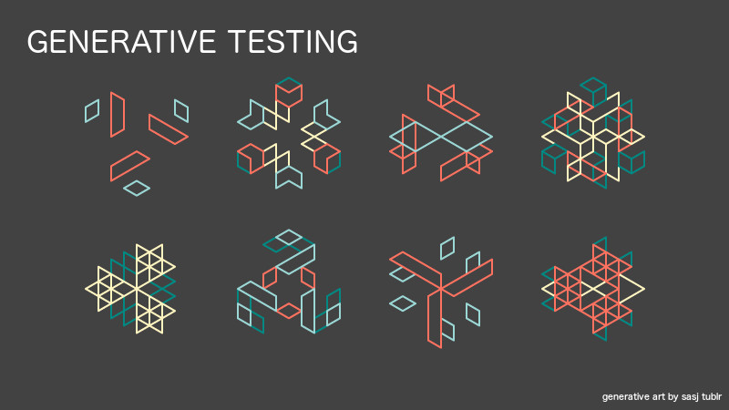

tags:: Clojure, technical, testing, video, meetup
presenter:: [[Ghadi Shayban]] 
date:: 2018-03-27

-
- 
-
- [[Ghadi Shayban]] demonstrates techniques toward achieving 100% code test coverage of code, libraries and APIs, without tedious test writing.
-
- Applicable to any technology running on the Java Virtual Machine: Java, Scala, Groovy, Clojure and more, including Java Libraries!
-
- Ghadi demonstrates Clojure Spec and Clojure's powerful native introspection in his interactive tutorial.
-
- Intended for ALL technical managers and software developers, no Clojure experience is necessary.
  
  * [video presentation](https://youtu.be/4Q_dNRIDMgE) (YouTube)
  * [[Ghadi Shayban]] biography 
  * [slides](../assets/GenerativeTesting.pdf) (pdf)
-
- <iframe id="ytplayer" type="text/html" width="640" height="390"
    src="https://www.youtube.com/embed/4Q_dNRIDMgE?autoplay=0&origin=http://functional.sc"  frameborder="0"></iframe>
-
- {{embed [[Ghadi Shayban]]}}