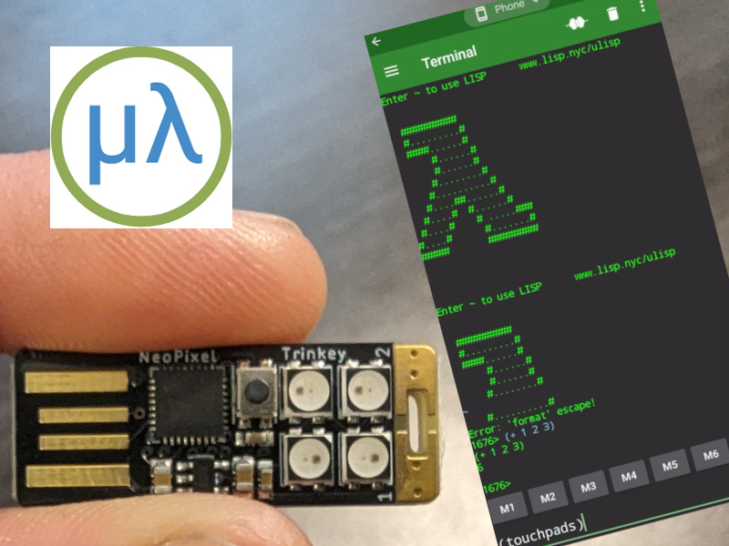

tags:: lisp, meetup
  date:: October 2, 2024
  event-url:: https://www.meetup.com/reforge/events/303531648
  presenter:: [[Heow Goodman]]

- # Budget Microcontroller Workshop
- # *How uLisp Simplifies Programming*
- ## Wednesday Oct 2nd 5:30 PM
-
- 
-
- In this workshop, we’ll introduce you to the world of uLisp, a streamlined version of the LISP 
  programming language tailored for microcontrollers. You’ll learn how to connect and program a NeoTrinkey - a compact powerful device with built-in lights and keypads from your Android phone, Chromebook or laptop.
-
- This session will guide you through basic control of the NeoTrinkey’s features even if you're unfamiliar to LISP or microcontroller programming.
-
- Plus, for just $5, you’ll receive your own NeoTrinkey and all the accessories you need to get started!
-
- **Note: does NOT work with an Apple phone!**
-
- Resources:
	- • [ulisp-neotrinkey](https://github.com/functional-sc/ulisp-neotrinkey) (github)
	- • [ulisp examples](https://github.com/functional-sc/ulisp-neotrinkey/tree/master/examples) (github)
	- • [handout uLisp Setup](../assets/uLisp-handout-setup_1728917338847_0.pdf) (pdf)
	- • [handout NeoTrinkey Additions](../assets/uLisp-handout-NeoTrinkey-reference_1728917377897_0.pdf) (pdf)
	- • [handout uLisp Cheatsheet Reference](../assets/uLisp-handout-cheatsheet_1728917418317_0.pdf) (pdf)
-