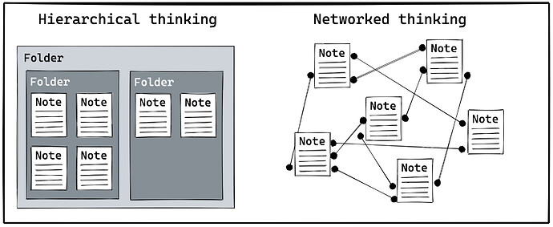
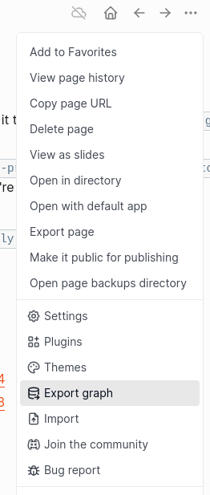

tags:: ClojureScript, Logseq, non-technical, article, management
date:: 2024-10-15
custom-url:: tech

- # 2024 Functional SC Website
-
- The newest iteration of this website is created with [Logseq](https://logseq.com), an open-source, **privacy-first knowledge management** and note-taking tool allowing you to organize thoughts, tasks and ideas in a graph-based, interconnected system using Markdown.
	-
- 
-
- It happens to be written in [[ClojureScript]], runs an edited [BlueTeaFrog Theme](https://github.com/blueteafrog/logseq-oxfordblue-theme) and supports many features as outlined in [[Content Creation]] Guidelines.
-
- We love that Logseq is:
	- • local first
	- • highly-connected Markdown wiki
	- • file-based, easy to share and synchronize
	- • runs on Linux, Mac, Windows, Android, iPhone, ChromeOS and web
-
- The entire site is published as an SPA (Single Page App) and can be served by any static web-head like a CDN, Apache or Nginx.
-
- # Rationale
-
- Logseq is a highly interactive living working tool ...which is atypical for a published static website, so we put forth some effort to make it look like a more traditional boring static website.
-
- **Everything is a bullet**
	- In Logseq everything is a bullet-point allowing for easy editing and deep linking to references.
	- But seeing so many bullet points on any website is distracting, *so we hid them with CSS*.
	- The downside is that if you want an actual bullet point with this code base, you need to drop in an emoji.
- **Query properties**
	- Normal website front ends are not queryable, but Logseq is and that results in a lot of power.
	- However, the general public does not need to see the tools and widgets for interacting with queries. *So we hid them with CSS.*
- **Page properties**
	- Page properties are great allowing you to add unlimited number of tags and and even hierarchies.
	- But they tend to be at the top of the page and can be distracting for novices. *So we hid them with CSS* but failed because [[Heow]] is not a font-end dev, so instead we need to hide them by editing the config.
	- Please [[contact us]] if you can help.
-
- Functional SC is an advocacy group that is not targeted to just developers but also businesses and leaders. Most of them don't care about the underlying tech distractions so we dial down the geek.
-
- Businesses do care about making or saving money which is where Logseq comes in. You can do such amazing quick work on such a small budget with fast turn around, collaboration and distribution with minimal backend services.  It's nothing short of amazing.
-
- # Publishing Process
-
- The process is different if you are editing content versus deploying to the webhead.
-
- On your desktop or laptop, [download and install Logseq](https://logseq.com/downloads)
  logseq.order-list-type:: number
- Download the [Knowledge Graph from Github](https://github.com/functional-sc/functional-sc-website-2024/tree/main/fpsc-website-graph)
  logseq.order-list-type:: number
- On a desktop, launch Logseq, select "Add a new Graph" and point it to the directory `fpsc-website-graph`
  logseq.order-list-type:: number
- Edit until you're happy, then send a Pull Request in GitHub
  logseq.order-list-type:: number
	- note: you'll probably want to comment out the `:block-hidden-properties` line of `logseq/custom.edn` to see the page properties, tags and aliases.  Re-comment when you're done.
	  logseq.order-list-type:: number
- If you're one of the FPSC devs, in the `...` menu Export Graph -> Export Public Pages
  logseq.order-list-type:: number
- Commit then run `bin/upload-content-only.sh`
  logseq.order-list-type:: number
-
- Like this:
- 
-
- resources:
	- • https://Logseq.com
	- • https://discuss.logseq.com/t/new-to-logseq-start-here/8468
	- • https://github.com/functional-sc/functional-sc-website-2024
	- • https://github.com/blueteafrog/logseq-oxfordblue-theme
-
-
-
-
-
-
-
-
-