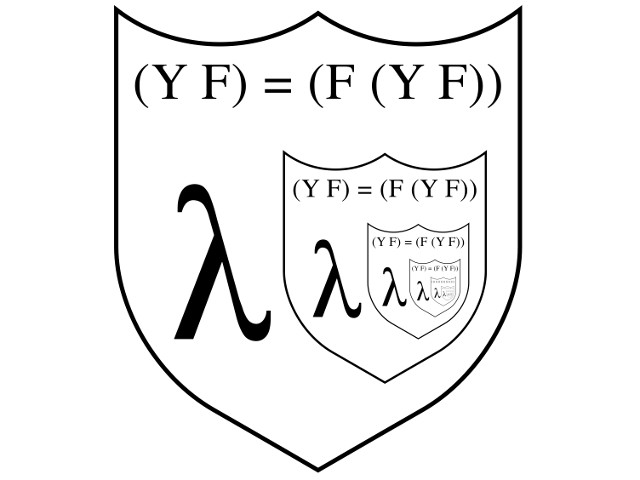

tags:: math, technical, math, article, video, meetup
presenter:: [[Jared Corduan]] 
date:: 2019-11-05

-
- 
-
- Lambda Calculus isn’t just a fancy word: it defines our software, our numbers and perhaps even reality itself.
-
- Starting from its beginnings in the search for mathematical foundations in the early 1900s, Dr. Jared Corduan introduces us to the history and fully explains basic lambda calculus. You will learn how to create a numeric system without numbers using pure functions.
-
- Heard of Y-Combinator? It’s developed with lambda calculus and is a powerful software development abstraction.
-
- Over 100 years after it was developed, find out how it impacts modern software development and why it matters most today.
  
  * [video presentation](https://youtu.be/acIBX5KpzY0) (YouTube)
  * [[Jared Corduan]] biography
  * [slides](../assets/LambdaCalculus.pdf) (pdf)
  * [python code](https://github.com/JaredCorduan/lambda-calc-cofc/blob/master/lambda.py)
-
- New extras!
  * [lambda calculus reducer & visualizer](https://projectultimatum.org/cgi-bin/lambda)
  * [play alligator eggs](http://worrydream.com/AlligatorEggs/) the Untyped Lambda Calculus table-top game
-
-
- <iframe id="ytplayer" type="text/html" width="640" height="390"
    src="https://www.youtube.com/embed/acIBX5KpzY0?autoplay=0&origin=http://functional.sc"  frameborder="0"></iframe>
-
- {{embed [[Jared Corduan]] }}
-