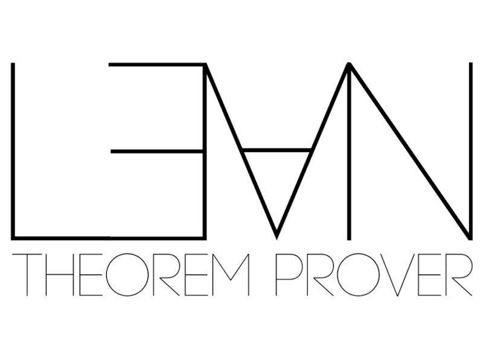
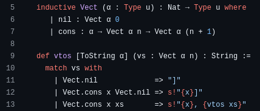

tags:: math, meetup, language
date:: 2024-08-02
presenter:: [[Jared Corduan]]

- {:height 608, :width 800}
- [Lean](https://lean-lang.org/about/) is a functional programming language with a highly expressive type system. It can be used to produce performant programs that are **guaranteed** to meet their specifications, meaning that a large class of bugs cannot exist in your program. It is also used to interactively prove theorems in mathematics.
-
- This Summer 2024 Series is for enthusiasts to join together to learn, code, and share their experiences with Lean.
-
- [Charleston Lean Meetup notes, examples and details now available!](https://github.com/lean-chs/charleston-lean-meetup) (github)
	- 
-
- [RSVP at the Charleston Learning Center](https://www.charlestonlc.org/classes/charleston-lean-proof-assistant-meetup/) for the next meeting:
-
- {{embed [[CDC Learning Center]]}}
-
- {{embed [[Jared Corduan]]}}
-