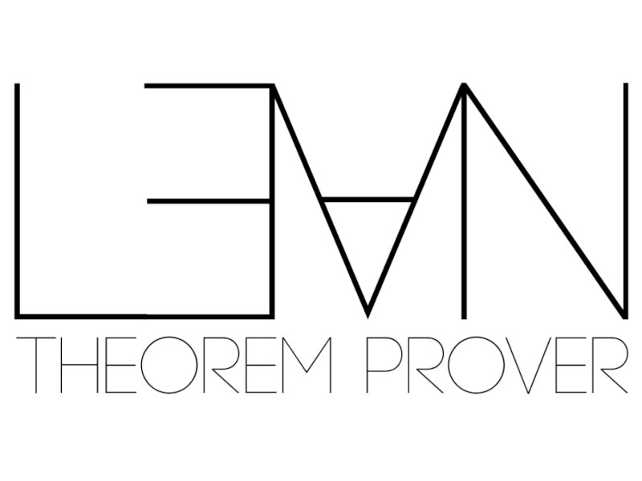

tags:: Language
custom-url:: lean

-
- {:height 608, :width 800}
- Lean is a formal proof assistant rather than a general-purpose programming language.  Lean is designed for creating, verifying and automating mathematical proofs and logical reasoning with a focus is on **ensuring the correctness of complex systems** and mathematical assertions through rigorous formalization.
-
- In practice it is a targeted functional-programming language allowing users to focus on the problem domain and manipulating its data rather than the details of programming.
-
- ### Business Rationale
- The Lean Theorem Prover offers businesses enhanced precision and reliability by **formalizing complex logical arguments** and automating proof processes and reducing errors.  Its ability to handle intricate systems ensures the **integrity of critical operations**.
-
- ### Developer Rationale
- For developers, the Lean Theorem Prover offers a powerful tool for **ensuring the correctness and reliability of code** through formal verification. Lean reduces the likelihood of bugs in critical systems allowing developers to focus on building software. Using Lean enhances a developer's ability to deliver high-quality, error-free software in industries where precision is paramount.
-
- ### Key Industries and Businesses
	- **Microsoft Research** uses Lean for software verification, ensuring correctness in critical codebases.
	- **Finance and Banking**: Financial institutions leverage Lean to formalize and verify algorithms for trading, risk assessment and regulatory compliance.
	- **Healthcare and Biotechnology**: Organizations use Lean to verify algorithms in medical devices and complex data models for patient safety and regulatory adherence.
-