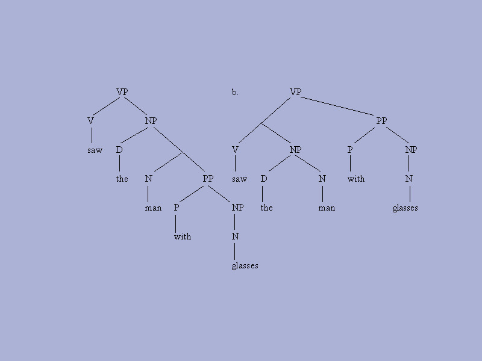

tags:: #compilers, technical, meetup, video
date:: 2016-12-20
presenter:: [[Kenneth Miller]]

- 
-
- Compilers are tools typically used to create binary we call software. Kenneth Miller has some interesting thoughts on extending the metaphor (and tools) to both human and programming languages.
-
- After a brief introduction of existing compiler technology, Kenneth discusses his ideas that include:
  
  * type checking natural languages
  * probabilistic type inference
  * an algebra for linguistic analysis
-
- Leading to some interesting tools and conclusions.
  
  This event is generously hosted by The Iron Yard Charleston.
  
  * [[Kenneth Miller]] biography 
  * [slides](../assets/LinguisticsAndCompilers.pdf) (pdf)
  
  <iframe id="ytplayer" type="text/html" width="640" height="390"
    src="https://www.youtube.com/embed/Ix6M9Nj_Dug?autoplay=0&origin=http://functional.sc"  frameborder="0"></iframe>
-
- {{embed [[Kenneth Miller]]}}