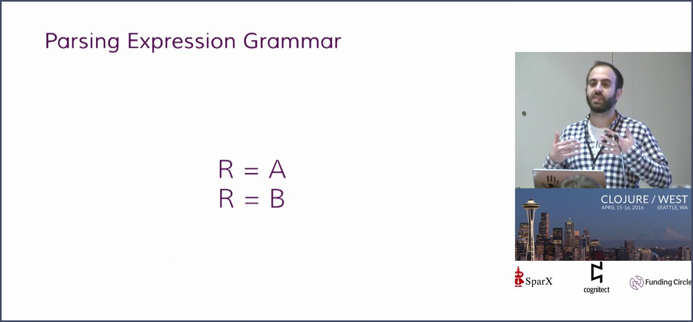

tags:: Clojure, technical, meetup, video
by:: [[Ghadi Shayban]] 
date:: 2016-04-16

- 
-
- As the saying goes, all the good ideas in computer science came from the 1970s. We'll explore a new library for parsing text that calls upon an old, unconventional approach: compiling parsers to custom bytecode and then running it through an interpreter. Along the way, we'll learn about how PEGs fit a sweet spot between regular expressions and heavier parsers, and how Clojure is an ideal language for writing simple compilers.
  
  [[Clojure]] West presentation by Functional SC member [[Ghadi Shayban]]
  
  Video presentation:
  
  [https://www.youtube.com/watch?v=9Q--oX5muxw](https://www.youtube.com/watch?v=9Q--oX5muxw)
-
- {{embed [[Ghadi Shayban]]}}