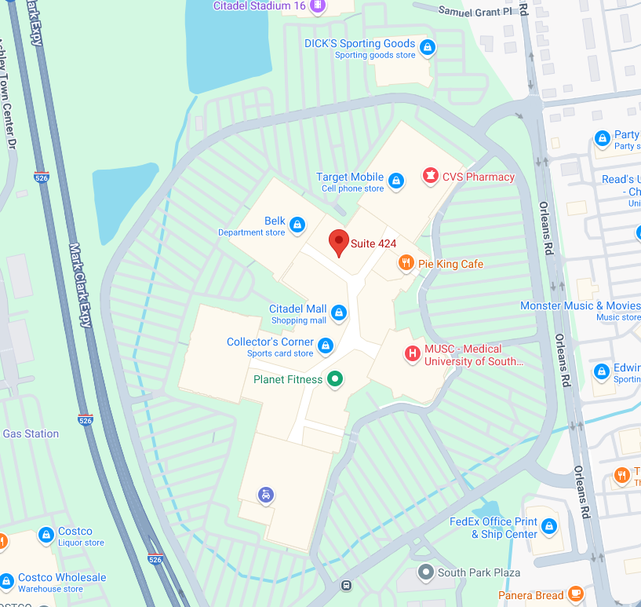

alias:: reforge
tags:: place
address:: [2070 Sam Rittenburg Blvd, Suite 424](https://www.google.com/maps/place/2070+Sam+Rittenberg+Blvd+Suite+424,+Charleston,+SC+29407)

- Located in Charleston at the Citadel Mall their 3,800 sq ft facility offers everything tinkerers, hobbyists, engineers, and inventors need, including equipment, instruction, and support. The space also features a 10-seat classroom with a projector for hands-on learning and workshops.
-
- Parking is plentiful, just [park at the Citadel Mall and enter near Belk.](https://www.google.com/maps/place/2070+Sam+Rittenberg+Blvd+Suite+424,+Charleston,+SC+29407)
-
- https://reforge.io/
-
- {:height 511, :width 532}
-
-