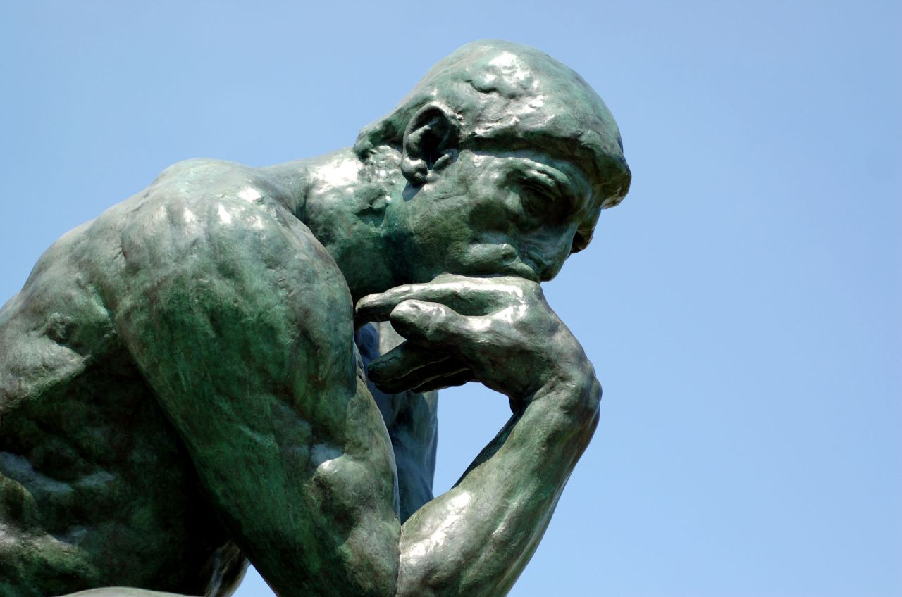

tags:: philosophy, semi-technical, article
date:: 2016-03-26

-
- 
-
- With such a conspicuous title you'd think this was meant to be ironic or a post-modern arthouse diatribe.  Nope, I'm just asking you to literally think differently, because the future depends on it.  Non-ironic drama intended.
  
  Nobody can predict the future, doubly so considering the oncoming trainlight of technical progress.  Generally speaking, the the next 20 years is going to be vastly different than the previous 200, bringing along unique challenges that we as a species will be ill-equipped to handle.
  
      New challenges require new solutions.
      
      Don't let your thinking fall into a rut.
      
      Don't let your tools dictate your options.  
  
  Big words that basicly say *don't solve tomorrows problems with yesterdays tools, systems and thought patterns*.  You should challenge yourself before the world challenges you.   Keep your mind nimble by learning new skills and techniques in order to thrive in an environment of constant change because that is the one think you can count on in the future.
  
  That's it for the philosophy, time to discuss your choice of tools for the future.
  
  Software is eating the world.  It's routinely appears in places previous thought impossible and will only grow.  If you think software is big now, it's only going to get bigger and more ubiquitous.
  
  And functional programming may not save the world.  As already mentioned the future is unknowable, however the world will not be saved by BASIC. We need a stepping stone to a technology base we can't even run today.  We won't do it with BASIC and we won't do it with the mindset of BASIC.  We need to change ourselves and the tools will follow.
  
  Consider this:
  
      "Lisp is worth learning for the profound enlightenment experience you will have when you finally get it; that experience will make you a better programmer for the rest of your days, even if you never actually use Lisp itself a lot."
	- Eric S. Raymond, "How to Become a Hacker"
	  
	  Functional programming is different, it will make you a different person by giving you perspectives unconsidered before, it's a unique advantage.
	  
	  Do yourself a favor, learn something different and think different.