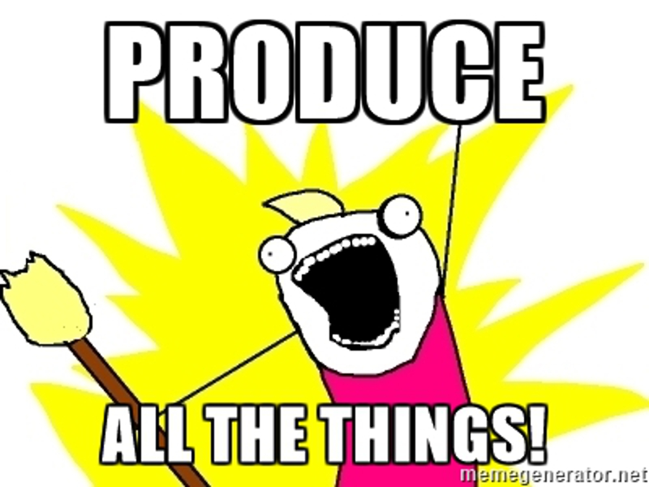

tags:: clojure, haskell, fsharp, ocaml, technical, article
date:: 2016-06-21

- ## Practical Functional Programming
- 
-
- When you're new to Functional Programming, or struggling to learn it after coming from an Object Oriented background, you're likely to ask: *"This is so different, what's the practical aspect?"*
-
- One giant practical aspect is laziness.
-
- ## Laziness
-
- Lazy evaluation is a feature commonly supported (but not limited to) functional languages.  In a nutshell, **lazy evaluation** is "call by need", or roughly "I'll give you the answer, but only when you need it."
-
- Although not immediately apparent, it's a powerful construct that allows unrelated parts of your system to remain unintwined, to **keep business logic separate** and out of the "plumbing" of your software.
-
- ## An Example of Eagerness
-
- An example of a typical program practice [1]:
  
  ```
  programmer: "Hey Boss, how many customers should the program display?"  
  boss:       "We usually have 10 per day."  
  programmer: "Ok, I'll make room for 100."  
  boss:       "Great, we'll never hit 100!"  
  ```
-
- The business logic of this is:
  
  > daily customers are about 10
- Due to space needs, the implementation logic (some may also call this business logic) is:
  
  > never exceed 100 customers
-
- As a result, the part of the program that PRODUCES the customers must always:
  
  1. Make room for 100 customers.
  2. Produce about 10 customers.
-
- The part of the program that CONSUMES (displays) the customers must always:
  
  1. Make room for 100 customers.
  2. Expect about 10 customers.
-
- If either the producer part of the program or the consumer part of the program fails to heed the "never exceed 100 customers" rule, disastrous things happen.  Disaster also happens if there are 0 customers.
-
- Disaster aside, BOTH the producer and consumer must each follow the business logic.  If the producer and consumer are in different parts of the system, which they are, then the **business logic is duplicated**.
-
- But why is that so bad?
-
- ### Duplicated Logic is a Maintenance Nightmare
-
- When the same logic is in two different parts of the system, suddenly your maintenance requirements have duplicated, or worse.
-
- Consider the same systems years later, when business increases and 101 customers is routine.  Then a new developer who is not familiar with BOTH the producer and consumer must make changes to the system.  Not only that but the programmer must ALWAYS get ALL of it right in ALL the PLACES.
-
- Now you understand why software fails.  Often badly.
-
- ### Display Dependent
-
- Additionally, having display logic in the depths of the program means the whole system is dependent on it.
-
- As you're well aware of, displays have changed radically over time, they're getting ever smaller and disappearing completely.  Computers and the way we use them change over time, so don't needlessly lock yourself in.
-
- ## A Lazy Example
-
- Rather than track what produces how many customers and how many are displayed and where, you can produce all the customers all the time.  However, eagerly producing 100,000,000 customers means things will break.
-
- Consider the option that the producer will be lazy.  That is, only the data that is **used** will be produced.  The act of asking for that data is what starts the producer producing.
-
- The interesting thing about being lazy, is that the producer **isn't started** until the data is actually **used**.   Even if the consumer asks the producer for data, the producer won't run until the data is displayed or referred to.
-
- Therefore the producer of the data will never do the work of producing if the data is never used!
-
- With a lazy producer, the streamlined business logic is:
  
  > Create a stream of customers.
-
- The business logic of the lazy consumer:
  
  > Display as many customers as needed.
- That's pretty simple, and functional languages offer this for free.
-
- ### Protip: where is my data?
-
- The producer won't produce unless the data is viewed, this leads to interesting debugging scenarios:
  
  ```
  programmer: Ok boss, the Lazy-Customer-Producer is ready to run!  
  boss:       Run it  
  programmer: I just ran it, but it finished in 0 seconds.
  programmer: I forgot, I need to look at the data or it's not produced!  
  ```
-
- ### Protip: oh no, all my data!
-
- Often the print mechanism of an environment can handle an infinite amount of data.  Be careful when using "print" to start a producer: the producer will produce until it runs out of data, which is "never" when dealing with infinite sets or streams.
  
  ```
  programmer: Ok boss, the Lazy-Customer-Producer is ready to run!  
  boss:       Run it  
  programmer: I just ran it, but it finished in 0 seconds.
  programmer: I forgot, I need to look at the data or it's not produced!  
  boss:       Be careful because...  
  programmer: I'll just "print Lazy-Customer-Producer"  
  boss:       Nooo....
  ```
-
- Now the programmer has to sit around while the console prints all 100,000,000 customers.  What you need to do is limit the amount asked for, such as *"print the first 10 customers from Lazy-Customer-Producer"*.
-
- ## Memoization is Laziness on Ambien
-
- How much lazier can you possibly get?  The producer won't even run if you assign it's data to a variable, you have to refer directly to it! [2]
-
- Welcome to memoization, or "don't do the same work twice".
-
- Suppose you have a function that is computationally heavy and takes time to run, but after running once, the function  knows the answer and can return it instantly.   Why do the same work twice?
-
- ```
  programmer: On the display, I don't want to re-calculate the credit ratings for all our customers.  Adding a layer of caching will complicate things.
  boss:       Just memoize it.
  ```
  
  Once a customer's credit rating is memoized (think "memorized"), calling the Calculate-Credt-Rating with the same customer will return the same answer **without** doing the re-calculation.  The memozied function remembers the answer it give you before and returns instantly.
  
  ```
  programmer:              Calculate-Credit-Rating (Customer-Alice)  
  Calculate-Credit-Rating: Alice's credit is 600.  Calculation time: 200ms  
  programmer:              Calculate-Credit-Rating (Customer-Alice)  
  Calculate-Credit-Rating: Alice's credit is 600.  Calculation time: 0ms  
  programmer:              Calculate-Credit-Rating (Customer-Bob)  
  Calculate-Credit-Rating: Bob's credit is 500.  Calculation time: 325ms
  ```
-
- ### Protip: memoize based on time
-
- It's not just computationally heavy functions that benefit from memoization, network ones do too!  If for instance your website displays tweets and you only get 1000 per day, then you don't have to call the Twitter API everytime.
-
- Memoize on time: your Call-Twitter function will remember the answer for say 10 minutes and only call the API after 10 or more minutes have passed.
-
- Memoization is a handy tool and easy to use, it's just another function call.
  
  ```
  9:01 programmer:   Count-Tweets  
  9:01 Count-Tweets: 606 tweets.  Run time: 100ms.  
  9:05 programmer:   Count-Tweets  
  9:05 Count-Tweets: 606 tweets.  Run time: 0ms.  
  9:12 programmer:   Count-Tweets  
  9:12 Count-Tweets: 607 tweets.  Run time: 101ms.
  ```
-
- ## Final Thoughts
- The combination of Lazy Evaluation and Memoization is a great way to reduce the cost of computing.  Only using what you need and being able to make decisions on when to recalculate greatly simplifies code and reduces distractions.
-
- This functionality is baked into the DNA of functional languages offered by [[Clojure]], [[Haskell]], [[F Sharp]], [[OCaml]] and more.  By using these languages there are no huge additional libraries, frameworks or worse: homegrown caching that must now be maintained and debugged.
-
- By reducing the mental overhead, you can concentrate and attend to the things that matter most: your business logic and not the plumbing of your program.
-
- Thanks!
-
- ## Footnotes
- 1. To the astute software developer: the author is well aware that your Favorite Programming Language can dynamically allocate space for 101 customers.  Don't debug the example, it is intentionally simple and yet common in many other forms.  Please pay attention to the point we're trying make.
- 2. This behavior is dependent on your programming language.  Some are lazier than others, just like people.
-